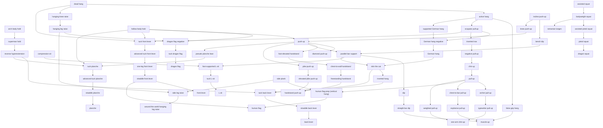

```mermaid
flowchart TD
  n0["active hang"]
  n1["advanced tuck front lever"]
  n2["advanced tuck planche"]
  n3["arch body hold"]
  n4["archer pull-up"]
  n5["around the world hanging leg raise"]
  n6["assisted pistol squat"]
  n7["assisted squat"]
  n8["back lever"]
  n9["bench dip"]
  n10["bodyweight squat"]
  n11["chest-to-bar pull-up"]
  n12["chest-to-wall handstand"]
  n13["chin-up"]
  n14["compression sit"]
  n15["dead hang"]
  n16["diamond push-up"]
  n17["dip"]
  n18["dragon flag"]
  n19["dragon flag negative"]
  n20["dragon squat"]
  n21["elevated pike push-up"]
  n22["explosive pull-up"]
  n23["false grip hang"]
  n24["foot-elevated handstand"]
  n25["foot-supported L-sit"]
  n26["freestanding handstand"]
  n27["front lever"]
  n28["German hang"]
  n29["German hang negative"]
  n30["handstand push-up"]
  n31["hanging knee raise"]
  n32["hanging leg raise"]
  n33["hollow body hold"]
  n34["human flag"]
  n35["human flag prep (vertical hang)"]
  n36["incline push-up"]
  n37["inverted hang"]
  n38["inverted row"]
  n39["knee push-up"]
  n40["L sit"]
  n41["muscle-up"]
  n42["negative pull-up"]
  n43["one-arm chin-up"]
  n44["one-leg front lever"]
  n45["parallel bar support"]
  n46["pike push-up"]
  n47["pistol squat"]
  n48["planche"]
  n49["pseudo planche lean"]
  n50["pull-up"]
  n51["push-up"]
  n52["reverse hyperextension"]
  n53["romanian lunges"]
  n54["scapular pull-up"]
  n55["side leg raise"]
  n56["side plank"]
  n57["skin the cat"]
  n58["straddle back lever"]
  n59["straddle front lever"]
  n60["straddle planche"]
  n61["straight bar dip"]
  n62["superman hold"]
  n63["supported German hang"]
  n64["tuck back lever"]
  n65["tuck dragon flag"]
  n66["tuck front lever"]
  n67["tuck L-sit"]
  n68["tuck planche"]
  n69["typewriter pull-up"]
  n70["weighted pull-up"]
  n15 --> n0
  n66 --> n1
  n68 --> n2
  n50 --> n4
  n55 --> n5
  n10 --> n6
  n58 --> n8
  n36 --> n9
  n7 --> n10
  n50 --> n11
  n24 --> n12
  n42 --> n13
  n51 --> n16
  n45 --> n17
  n65 --> n18
  n32 --> n19
  n33 --> n19
  n47 --> n20
  n46 --> n21
  n11 --> n22
  n0 --> n23
  n51 --> n24
  n45 --> n25
  n14 --> n25
  n12 --> n26
  n59 --> n27
  n29 --> n28
  n63 --> n29
  n54 --> n29
  n21 --> n30
  n26 --> n30
  n15 --> n31
  n31 --> n32
  n35 --> n34
  n59 --> n34
  n56 --> n35
  n50 --> n35
  n57 --> n37
  n54 --> n38
  n36 --> n39
  n67 --> n40
  n22 --> n41
  n61 --> n41
  n23 --> n41
  n38 --> n42
  n70 --> n43
  n69 --> n43
  n1 --> n44
  n51 --> n45
  n9 --> n45
  n51 --> n46
  n6 --> n47
  n60 --> n48
  n51 --> n49
  n13 --> n50
  n39 --> n51
  n33 --> n51
  n62 --> n52
  n10 --> n53
  n0 --> n54
  n32 --> n55
  n56 --> n55
  n28 --> n57
  n45 --> n57
  n64 --> n58
  n44 --> n59
  n2 --> n60
  n17 --> n61
  n3 --> n62
  n0 --> n63
  n57 --> n64
  n37 --> n64
  n52 --> n64
  n19 --> n65
  n33 --> n66
  n15 --> n66
  n54 --> n66
  n25 --> n67
  n49 --> n68
  n33 --> n68
  n52 --> n68
  n4 --> n69
  n50 --> n70
```
