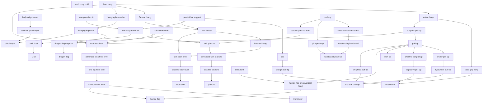

```mermaid
flowchart TD
  n0["active hang"]
  n1["advanced tuck front lever"]
  n2["advanced tuck planche"]
  n3["arch body hold"]
  n4["archer pull-up"]
  n5["assisted pistol squat"]
  n6["back lever"]
  n7["bodyweight squat"]
  n8["chest-to-bar pull-up"]
  n9["chest-to-wall handstand"]
  n10["chin-up"]
  n11["compression sit"]
  n12["dead hang"]
  n13["dip"]
  n14["dragon flag"]
  n15["dragon flag negative"]
  n16["explosive pull-up"]
  n17["false grip hang"]
  n18["foot-supported L-sit"]
  n19["freestanding handstand"]
  n20["front lever"]
  n21["German hang"]
  n22["handstand push-up"]
  n23["hanging knee raise"]
  n24["hanging leg raise"]
  n25["hollow body hold"]
  n26["human flag"]
  n27["human flag prep (vertical hang)"]
  n28["inverted hang"]
  n29["L sit"]
  n30["muscle-up"]
  n31["one-arm chin-up"]
  n32["one-leg front lever"]
  n33["parallel bar support"]
  n34["pike push-up"]
  n35["pistol squat"]
  n36["planche"]
  n37["pseudo planche lean"]
  n38["pull-up"]
  n39["push-up"]
  n40["scapular pull-up"]
  n41["side plank"]
  n42["skin the cat"]
  n43["straddle back lever"]
  n44["straddle front lever"]
  n45["straddle planche"]
  n46["straight bar dip"]
  n47["tuck back lever"]
  n48["tuck front lever"]
  n49["tuck L-sit"]
  n50["tuck planche"]
  n51["typewriter pull-up"]
  n52["weighted pull-up"]
  n12 --> n0
  n48 --> n1
  n50 --> n2
  n38 --> n4
  n7 --> n5
  n43 --> n6
  n38 --> n8
  n39 --> n9
  n38 --> n10
  n33 --> n13
  n15 --> n14
  n24 --> n15
  n25 --> n15
  n8 --> n16
  n0 --> n17
  n33 --> n18
  n11 --> n18
  n9 --> n19
  n44 --> n20
  n12 --> n21
  n34 --> n22
  n19 --> n22
  n12 --> n23
  n23 --> n24
  n27 --> n26
  n44 --> n26
  n41 --> n27
  n38 --> n27
  n42 --> n28
  n49 --> n29
  n16 --> n30
  n46 --> n30
  n17 --> n30
  n52 --> n31
  n51 --> n31
  n1 --> n32
  n39 --> n34
  n5 --> n35
  n24 --> n35
  n45 --> n36
  n39 --> n37
  n40 --> n38
  n0 --> n40
  n21 --> n42
  n33 --> n42
  n47 --> n43
  n32 --> n44
  n2 --> n45
  n13 --> n46
  n42 --> n47
  n28 --> n47
  n25 --> n48
  n12 --> n48
  n40 --> n48
  n18 --> n49
  n37 --> n50
  n25 --> n50
  n4 --> n51
  n38 --> n52
```
